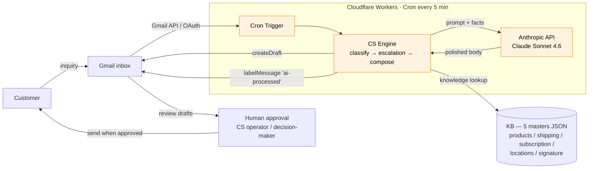

# cs-rag-engine

> **AI customer support automation engine** for a D2C sweets brand (RAG + LLM judge + Cloudflare Workers).
> Target: **90%+ of 150–300 monthly inquiries handled without human approval**.
> Achieved: **escalation precision 98%, zero hallucinated facts, pass rate 73% → 80% in 5 business days**.

[](#)
[](#)
[](#)
[](LICENSE)

> **About this repository.** This is an **anonymized portfolio mirror** of a real freelance client project (a Japanese D2C sweets brand). The architecture, evaluation framework, and Cloudflare Workers infrastructure are reproduced faithfully; client names, customer data, and production prompts have been replaced. The original production code remains private — face-to-face demo available on request.

---

## TL;DR

| metric | value (production system) |
|---|---|
| Inquiries handled | **~127/month** (extracted from 40-day inbound log) |
| **Escalation precision** | **49/50 (98.0%)** |
| **FN (unsafe miss)** | **0** |
| **Zero-hallucination cases (H=0)** | **0/49 — Hard Rule respected** |
| Pass rate on LLM judge | **73% → 80%** (+7 pp in 5 business days) |
| Build cost (freelance) | **¥198,000** vs typical SI vendor ¥1.5M–¥30M |
| Monthly run cost | **¥16,500** (Cloudflare + Anthropic + ops) |
| Runtime | **Cloudflare Workers · Cron 5min · 24/7 PC-free** |

---

## 1. Problem

A small D2C team was running CS through a manual loop: customer mail / LINE / IG → ticketed in group chat → operator drafts reply → decision-maker approves → send. At ~127 inquiries/month this **bottlenecked the operator**, and the published FAQ was out of date (e.g. "shelf life 15–30 days" contradicted the new "frozen ~1 month" rule). A SaaS vendor would have quoted ¥1.5M–¥30M build + ¥30k–¥500k/month run — far outside the startup budget.

What was needed: a CS automation system that fits a startup budget, that **enforces "draft only, human sends"** at the code level (not just the prompt), and that has a measurable improvement loop.

---

## 2. Solution — three design pillars

### 2.1 Architecture



### 2.2 Pillar 1 — Hard Rule enforcement at the code level

> The most common LLM CS failure is "we wrote 'don't send' in the prompt and a model update broke it". We avoid this by removing the failure mode at the code level.

- **No `sendMessage` codepath exists in the engine.** The only Gmail write API used is `createDraft`. A model that "wants" to send cannot — the import isn't there.
- **Required escalations are code branches**, not prompt instructions. `escalation.ts` filters foreign-object/health, refund/coupon/transfer, legal mentions, vending install requests, etc. *before* any LLM call.
- **Fixed signature is concatenated by code from `master_signature.json`** — the LLM is forbidden from generating it.
- **KB-only facts.** If the KB doesn't say it, the model must answer "[要確認: …]" or escalate.

See [`docs/safety-rules.md`](docs/safety-rules.md) for the seven required-escalation categories.

### 2.3 Pillar 2 — Single Source of Truth: 5 JSON masters

Time-varying facts live in **only one place** — `data/kb/*.json`:

| master | content |
|---|---|
| `master_products.json` | currently-selling flavors, shelf life, channels, aliases |
| `master_shipping.json` | per-channel shipping estimates, date/time specification, time-bounded notice (`current_notice` with `valid_until`) |
| `master_subscription.json` | new-signup status, change/cancel rules |
| `master_locations.json` | active and removed vending machines |
| `master_signature.json` | the customer-facing signature block |

The operator notifies the engineer of a change → the engineer updates the master + bumps `updated_at` / `updated_by` → next deploy reflects same day. `data/extracted/templates_v2.jsonl` is the operator-approved reply boilerplate (≈ 19 templates in production, 11 in this sample).

### 2.4 Pillar 3 — Golden set + LLM-as-judge

- **Golden set** — 50 anchored real-customer cases (10 synthetic samples in this public mirror) labeled with expected category + escalation flag + difficulty (`easy`/`normal`/`trap`).
- **LLM judge** scores each generated draft on two axes (`factual_alignment`, `no_hallucination`) on a 0/1/2 scale. The rubric is in [`.claude/skills/eval-rubric/SKILL.md`](.claude/skills/eval-rubric/SKILL.md).
- **`/eval-analyze-improve`** Claude Code skill runs the deterministic eval, scores the worst-5, classifies root causes (KB / prompt / classifier / template), and writes an improvement log. Combine with `/loop 1d` to run daily, autonomously.

Real iteration from the production loop:

> Baseline (2026-06-13): factual_alignment 1.67, pass rate 73%.
> Day +5 (2026-06-17): SYSTEM_PROMPT line added enforcing template `notes`; PRODUCT_ALIASES expanded; payment classifier co-occurrence rule. → factual_alignment **1.77**, pass rate **80%**. Three of the worst-5 closed without regressing the rest.

### 2.5 Tech stack

| layer | choice | why |
|---|---|---|
| Engine | **TypeScript** (Node 22.18+) | Imports straight into Cloudflare Workers, no build step |
| LLM | **Anthropic Claude Sonnet 4.6** | Japanese keigo quality; reliable JSON output for the judge |
| Knowledge store | **5 JSON masters** (no vector DB) | At this size, `git diff` on `master_*.json` is a better audit than ChromaDB. Vector storage can be added when the KB grows. |
| Inbox | **Gmail API (OAuth 2.0 Desktop)** | The brand's main channel. refresh_token → 24/7 |
| Hosting | **Cloudflare Workers + Cron Triggers** | Always-on; no PC required; a few dollars/month |
| Secrets | **`wrangler secret`** | Encrypted at the platform |
| Evaluation | **LLM-as-judge (Claude)** | Reproduces human scoring at ~1/10 the cost |

---

## 3. Repository layout

```
cs-rag-engine/
├── README.md                       ← this file
├── LICENSE                         ← MIT
├── docs/
│   ├── architecture.md             ← full diagram + data flow
│   ├── safety-rules.md             ← Hard Rule + 7 required-escalation categories
│   └── eval-methodology.md         ← golden set + LLM judge + improvement loop
├── src/
│   ├── engine/                     ← classify / escalation / compose / compose_llm / gate / kb
│   ├── eval/                       ← run / gate_report / llm_quality (LLM judge)
│   ├── mail/                       ← half-manual MCP-Gmail loop
│   ├── adapters/line-harness.ts    ← LINE adapter (sidecar or embedded)
│   └── cli.ts / demo.ts / demo_llm.ts
├── workers/                        ← Cloudflare Workers production loop
│   ├── src/                        ← cron entry + auth + Gmail client + bundled engine
│   ├── scripts/                    ← build_kb + get_refresh_token
│   ├── wrangler.toml
│   └── README.md                   ← deploy guide
├── data/
│   ├── kb/                         ← 5 sample masters (anonymized fictional brand)
│   ├── extracted/                  ← sample templates_v2.jsonl
│   └── eval/                       ← sample golden set (10 cases)
└── .claude/
    ├── commands/cs-triage.md       ← unanswered LINE triage + send-on-approval
    ├── commands/eval-analyze-improve.md ← daily worst-5 → improvement log
    └── skills/eval-rubric/SKILL.md ← rubric used by the LLM judge
```

---

## 4. Try it locally

```bash
git clone https://github.com/kydlp/cs-rag-engine
cd cs-rag-engine
npm install

# Deterministic demo (no API key needed):
npm run demo
node src/demo.ts "賞味期限はどれくらい？"

# Golden-set evaluation:
npm run eval
npm run eval:report   # writes reports/eval_baseline.md

# LLM judge (requires API key):
ANTHROPIC_API_KEY=sk-ant-... npm run eval:llm
```

---

## 5. Deploy (Cloudflare Workers)

```bash
cd workers
npm install
npx wrangler login

# Obtain a refresh_token once (local):
GOOGLE_CLIENT_ID=... GOOGLE_CLIENT_SECRET=... \
  node scripts/get_refresh_token.mjs

# Register secrets:
npx wrangler secret put ANTHROPIC_API_KEY
npx wrangler secret put GOOGLE_CLIENT_ID
npx wrangler secret put GOOGLE_CLIENT_SECRET
npx wrangler secret put GOOGLE_REFRESH_TOKEN

# Bundle KB and deploy:
npm run build-kb
npm run deploy
```

Edit `wrangler.toml` `crons = ["*/5 * * * *"]` and re-deploy to enable the schedule.

Full guide: [`workers/README.md`](workers/README.md).

---

## 6. Out of scope (by design)

- **Auto-send to customers** — Hard Rule. The engine has no `sendMessage` code path.
- **Attachment handling** — foreign-object cases need a human to inspect the photo.
- **Stale thread context** — only the latest customer message is used; we deliberately avoid mis-grounding on past exchanges.

---

## 7. What I learned (notes for the next project)

- **"Bind the LLM with code, not the prompt."** Removing send code entirely is more robust than asking the model not to send.
- **At ~120 inquiries/month, pgvector / ChromaDB is overkill.** 5 JSON masters are auditable via `git diff` and small enough that the LLM can see the full relevant snapshot. Swap to a vector store when the KB grows past a few hundred entries.
- **A fast improvement loop (73→80% in 5 days) is the most credible commercial deliverable.** It proves continuous improvement, not just a baseline.
- **Cloudflare Workers + Cron flattens the operational story.** "No PC required, costs $5/month" matters a lot for a freelance contract.

---

## 8. Acknowledgements

This is the public-facing version of a freelance project. The production system, customer LINE / mail logs, and contractual details remain private. The original engineering effort (knowledge extraction, evaluation framework, safety design, deployment) was solo over ~6 weeks.

## License

MIT — see [`LICENSE`](LICENSE). The sample KB + golden set in this repository are entirely synthetic.

## Contact

- GitHub: [@kydlp](https://github.com/kydlp)
- Email: motchiapple@gmail.com

Production code, full evaluation logs, and detailed cost / agreement-rate metrics are available on request (e.g. for a recruiting / consulting conversation).
