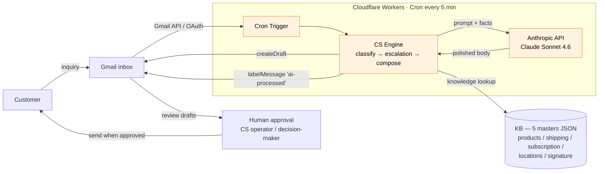

# Architecture

## High level



## Module map

```
src/engine/                         deterministic core (no fs in Workers build)
├── types.ts        Inquiry / EngineResult / Category / Channel
├── classify.ts     keyword/trigger classifier (LLM-swappable)
├── escalation.ts   hard rules + KB freshness + confidence floor
├── compose.ts      template + KB-driven deterministic composer
├── compose_llm.ts  KB-grounded LLM polish (fallback to compose on failure)
├── gate.ts         safety floor + auto-send allowlist + shadow mode
├── kb.ts           knowledge base loader (fs in src/, JSON modules in workers/)
└── index.ts        answer() — orchestration

src/eval/                           reproducibility + improvement loop
├── run.ts          golden-set evaluation (category / escalation / templates)
├── gate_report.ts  shadow-mode prediction analysis
└── llm_quality.ts  structural check + LLM-as-judge scoring

src/mail/                           half-manual MCP-Gmail loop
└── run_inbox.ts → processInbound → toGmailDraft → MCP create_draft

workers/src/                        Cloudflare Workers production loop
├── index.ts        Cron 5min entry → fetch Gmail → engine → draft
├── auth/google.ts  refresh_token → access_token
└── mail/gmail.ts   Gmail API client (list / get / createDraft / label)
```

## Data flow per inbound mail

```
Gmail thread
   ↓ Gmail API list/get
InboundMail { from, subject, body, channel, customerName }
   ↓ classify()
{ category, confidence, scores }
   ↓ decideEscalation()  ← reads master_shipping.current_notice for freshness
{ escalate, reason, notices, categoryOverride? }
   ↓ compose() / composeLLM()
{ draft, needsInfo, sources }
   ↓ decideSend()        ← safety floor + allowlist + shadow
{ predictedMode, effectiveMode, reasons }
   ↓ toGmailDraft()
{ to, subject, body, threadId, inReplyTo }
   ↓ Gmail createDraft
Gmail Drafts folder  ← human reviews & sends here
```

## Why two KB loaders?

Cloudflare Workers can't read from disk. The Workers build of `kb.ts` uses
`import data from "./kb/foo.json" with { type: "json" }`. The Node build of `kb.ts` uses
`readFileSync` so the same code works for local CLI / eval. `workers/scripts/build_kb.mjs` syncs `data/kb/` into `workers/src/kb/` before deploy.

The masters themselves are identical — just the loader differs.

## Why no streaming / no agent loop?

A reply draft is one short response per inquiry. There's no multi-turn or tool-use loop. Anthropic's Messages API call returns a single body, which we post-process (salutation prefix, signature append) and write to Gmail Drafts. Cron 5min is enough — no Durable Object or queue is needed.

## Hard Rule enforcement (code-level)

| Rule | Where enforced |
|---|---|
| AI never sends to customer | The engine has **no `sendMessage` code path**. Only `createDraft`. |
| KB-only facts | `composeLLM` builds a grounding context from masters; system prompt forbids inventing facts; deterministic fallback uses only template + master values. |
| Required escalations | `escalation.ts` `HARD_ESCALATION` + `ALWAYS_ESCALATE` — code branches, not prompt instructions. |
| Fixed signature | Code concatenates `master_signature.json` after the LLM body — the LLM is never asked to generate it. |
| KB freshness | `noticeValid()` checks `current_notice.valid_until` before quoting it; expired ⇒ escalate. |

## Cost shape

| component | rough monthly cost |
|---|---|
| Cloudflare Workers (Free → Paid) | $0–$5 |
| Anthropic Sonnet 4.6 (≈ 1k input + 500 output tokens × 180 inquiries/mo) | a few US dollars at posted rates |
| Gmail API | free within fair use |

Total: low single-digit dollars per month for a ~180 inquiry/month brand. A larger brand scales linearly.
